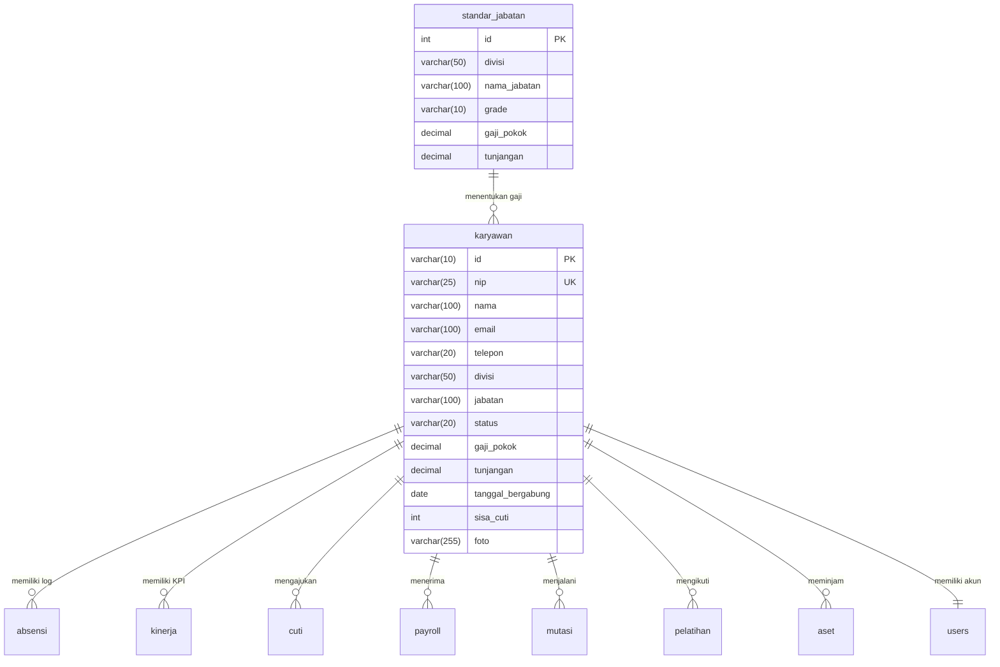

# 📂 DOKUMEN PANDUAN TEKNIS DAN SPESIFIKASI SISTEM SIMKAB
> **Sistem Informasi Manajemen Karyawan Bank (SIMKAB)**
> Versi Dokumen: 2.1 (Terbaru)  
> Tanggal Rilis: 25 Mei 2026

Dokumen teknis komprehensif ini dirancang khusus untuk memberikan pemahaman menyeluruh tentang arsitektur, basis data, alur proses bisnis, peran pengguna (*roles*), serta cara kerja detail setiap fitur pada sistem **SIMKAB**. Dokumen ini dapat digunakan sebagai referensi utama untuk penyelarasan pembuatan Gantt Chart, perancangan diagram Visio (Context, DFD, Flow Map), dokumentasi UML (Use Case, Class, Sequence), desain antarmuka Figma, serta penyusunan Laporan Laporan Tugas Akhir/RPL.

---

## BAB 1: PENDAHULUAN & TUJUAN SISTEM

### 1.1 Latar Belakang
Dalam industri perbankan yang memiliki tingkat kepatuhan regulasi tinggi (*highly regulated*), pengelolaan sumber daya manusia (SDM) membutuhkan presisi, transparansi, dan keamanan yang sangat ketat. Proses manual dalam pencatatan absensi, pengajuan cuti, perhitungan gaji bulanan, rotasi jabatan, serta pelacakan aset dinas rawan terhadap manipulasi data dan inefisiensi operasional. 

**SIMKAB (Sistem Informasi Manajemen Karyawan Bank)** hadir sebagai platform digital terintegrasi berbasis web untuk otomatisasi tata kelola administrasi kepegawaian internal bank secara real-time.

### 1.2 Tujuan Utama Sistem
1. **Otomatisasi Administrasi Kepegawaian:** Meminimalkan proses manual dalam penginputan data karyawan baru, penilaian kinerja, pengajuan cuti, absensi harian, dan penyusunan laporan payroll.
2. **Akurasi Absensi Berbasis Geofencing:** Menghilangkan kecurangan absensi (*titip absen*) dengan memanfaatkan validasi koordinat geografis nyata (GPS) dan swafoto (Selfie) wajah karyawan.
3. **Kepatuhan dan Standardisasi Skala Gaji:** Menerapkan regulasi penyesuaian gaji otomatis yang didasarkan pada tingkat golongan/grade jabatan perbankan guna memastikan keadilan dan kepatuhan finansial.
4. **Transparansi Riwayat Kepegawaian:** Menyediakan rekam jejak digital tanpa batas (*audit trail*) terhadap mutasi jabatan, promosi, cuti, serta kepemilikan sertifikasi kompetensi perbankan.

---

## BAB 2: PERAN PENGGUNA & MATRIKS OTORISASI (ROLES & PERMISSIONS)

Sistem SIMKAB dirancang menggunakan metode **RBAC (Role-Based Access Control)** yang membagi hak akses ke dalam 3 peran utama ditambah 1 peran eksternal.

### 2.1 Deskripsi Peran
1. **Super Admin / IT Administrator:**
   * Bertanggung jawab penuh terhadap pemeliharaan sistem, pembuatan akun pengguna, konfigurasi parameter database, pemantauan log audit, dan memiliki hak akses *Write, Read, Update, Delete (CRUD)* di semua tabel basis data.
2. **HRD (Human Resources Department):**
   * Bertanggung jawab atas pengelolaan data kepegawaian, verifikasi pengajuan cuti karyawan, penilaian KPI kinerja bulanan/kuartalan, pemrosesan slip gaji bulanan (Payroll), otorisasi mutasi/rotasi, serta verifikasi kelayakan sertifikat pelatihan.
3. **Karyawan (Staf Bank):**
   * Pengguna akhir sistem yang memiliki hak akses terbatas untuk melakukan E-Absensi harian, pengajuan cuti pribadi, mengunggah sertifikat pelatihan baru, memantau riwayat aset yang dipinjam, melihat penilaian kinerja diri, serta mengunduh slip gaji bulanan secara mandiri.
4. **Pelamar (Aktor Eksternal / Public):**
   * Pengunjung luar yang mengakses landing page SIMKAB untuk melihat lowongan karir aktif dan mengirimkan lamaran pekerjaan (CV) ke dalam database sistem.

### 2.2 Matriks Otorisasi Menu & Fitur

| Modul Fitur | Fungsi Utama | Admin | HRD | Karyawan | Pelamar |
| :--- | :--- | :---: | :---: | :---: | :---: |
| **1. Dashboard Analytics** | Visualisasi statistik pegawai, persentase kehadiran, dan grafik tren KPI | **Full (Semua Divisi)** | **Full (Semua Divisi)** | **Hanya Personal** | - |
| **2. Manajemen Karyawan** | CRUD profil, detail kepegawaian, dan data sensitif gaji | **Full CRUD** | **Full CRUD** | **Hanya Lihat Profil** | - |
| **3. Penilaian Kinerja** | Input nilai KPI (Kedisiplinan, Kerjasama, Inisiatif, Target) | **Full CRUD** | **Full CRUD** | **Hanya Lihat Nilai** | - |
| **4. Manajemen Payroll** | Proses kalkulasi gaji, cetak slip PDF bulanan | **Full CRUD** | **Full CRUD** | **Hanya Unduh Slip** | - |
| **5. Pengajuan Cuti** | Permohonan libur kerja, potong kuota sisa cuti otomatis | **Full CRUD** | **Approval & Otorisasi** | **Pengajuan & Riwayat** | - |
| **6. E-Absensi GPS** | Check-in/out berbasis koordinat GPS nyata + Foto Selfie | **Full Monitor** | **Monitor Log Harian** | **Check-in/out & Izin** | - |
| **7. Riwayat Mutasi** | Pengajuan rotasi, promosi, demosi, dan auto-penyesuaian gaji | **Full CRUD** | **Full CRUD** | **Hanya Lihat Riwayat** | - |
| **8. Pelatihan & Sertifikat**| Portofolio kompetensi perbankan dan lisensi | **Full CRUD** | **Verifikasi Data** | **Unggah & Pengajuan** | - |
| **9. Inventaris Aset** | Lacak nomor seri dan peminjaman fasilitas bank (Laptop/Mobil) | **Full CRUD** | **Full CRUD** | **Hanya Lihat Milik Diri** | - |
| **10. Memo Pengumuman** | Publikasi edaran prioritas direksi internal | **Full CRUD** | **Posting Pengumuman** | **Hanya Baca** | - |
| **11. Karir Pelamar** | Pintu pendaftaran rekrutmen bank eksternal | **Full CRUD** | **Full CRUD** | - | **Kirim Lamaran** |

---

## BAB 3: ARSITEKTUR TEKNOLOGI & STRUKTUR BERKAS

SIMKAB dikembangkan dengan konsep **Modular Single-Page Application (SPA)** murni tanpa library pihak ketiga yang kompleks, menghasilkan performa rendering super cepat dan konsumsi memori server yang minim.

### 3.1 Stack Teknologi
* **Backend:** PHP 7.4+ Native dengan ekstensi PDO (PHP Data Objects) untuk mencegah kerentanan SQL Injection.
* **Database:** MySQL 5.7+ / MariaDB 10.4+.
* **Frontend:** HTML5 Semantic Markup, Vanilla CSS3 (menggunakan CSS Variables untuk tema transisi Dark/Light Mode), Vanilla JavaScript Modern (ES6+ AJAX Fetch API).
* **Library Grafik:** Chart.js (diintegrasikan secara adaptif dengan pergantian warna Dark Mode).

### 3.2 Diagram Struktur Berkas Proyek (GitHub & XAMPP)
```
📁 SIMKAB_Kelompok_3_RPL / C:\xampp\htdocs\simkab\
├── 📄 index.php                   # Halaman container utama SPA (menampung routing)
├── 📄 api.php                     # Gateway API Utama (berfungsi memproses AJAX dan mengembalikan JSON)
├── 📄 config.php                  # Konfigurasi parameter database PDO
├── 📄 landing.php                 # Landing page publik (termasuk portal lowongan kerja)
├── 📄 login.php                   # Halaman otentikasi login karyawan & admin
├── 📄 logout.php                  # Penghancuran sesi otentikasi (session destroy)
├── 📄 database.sql                # Skema pembuatan tabel & Data Seeding standar jabatan
├── 📁 config/
│   └── 📄 database.sql            # Cadangan skema database relasional terbaru
├── 📁 assets/                     # Direktori aset statis (pada server & git)
│   ├── 📁 css/
│   │   └── 📄 style.css           # Tema utama visual (Dark-Gold premium aesthetic)
│   ├── 📁 js/
│   │   ├── 📄 app.js              # Otak logika frontend (AJAX Fetch, GPS, PDF, Slip Gaji)
│   │   └── 📄 chart-configs.js    # Konfigurasi inisialisasi grafik perbankan Chart.js
│   └── 📁 img/                    # Aset logo, ikon, dan background perbankan
├── 📁 modules/ / 📁 pages/         # Potongan modul tampilan HTML (SPA views)
│   ├── 📄 dashboard.php           # Tampilan statistik visual analitik
│   ├── 📄 karyawan.php            # Tampilan formulir CRUD dan tabel karyawan
│   ├── 📄 absensi.php             # Tampilan panel absensi GPS + kamera selfie
│   ├── 📄 cuti.php                # Tampilan formulir pengajuan dan persetujuan cuti
│   ├── 📄 payroll.php             # Tampilan slip gaji dan rekapitulasi penggajian
│   ├── 📄 kinerja.php             # Tampilan penilaian kinerja KPI karyawan
│   ├── 📄 mutasi.php              # Tampilan log riwayat mutasi / promosi karir
│   ├── 📄 pelatihan.php           # Tampilan portofolio sertifikat keahlian bank
│   ├── 📄 aset.php                # Tampilan inventarisasi peminjaman barang dinas
│   └── 📄 pengumuman.php          # Tampilan edaran memo internal bank
└── 📁 uploads/                    # Folder penyimpanan fisik berkas yang diunggah
    ├── 📁 sertifikat/             # PDF/Gambar bukti sertifikat kompetensi
    ├── 📁 absensi/                # Foto check-in/out absensi selfie harian
    └── 📁 profil/                 # Foto profil resmi karyawan
```

---

## BAB 4: SKEMA DATA RELASIONAL & KAMUS DATA (DATABASE SCHEMA)

Database bernama `db_simkab` mengimplementasikan integritas referensial yang sangat ketat untuk mencegah ketidakkonsistenan data kepegawaian.

### 4.1 Entitas & Diagram Hubungan Relasional (ERD)
Seluruh tabel transaksi terhubung ke tabel master `karyawan` menggunakan relasi **One-to-Many (1:N)** dengan opsi `ON DELETE CASCADE`, sehingga jika data karyawan dihapus, semua log absensi, payroll, cuti, kinerja, pelatihan, aset, dan akun user yang terhubung akan terhapus secara otomatis dan aman.



### 4.2 Kamus Data Detail Tabel

#### 1. Tabel `karyawan` (Master Data Pegawai)
Menyimpan informasi identitas utama, penempatan divisi, jabatan aktif, gaji dinamis, dan jatah cuti karyawan.
*   `id` (VARCHAR(10), Primary Key): Kode unik karyawan (contoh: `EMP001`).
*   `nip` (VARCHAR(25), Unique): Nomor Induk Pegawai unik nasional (contoh: `199807202022031005`).
*   `nama` (VARCHAR(100)): Nama lengkap karyawan tanpa gelar.
*   `email` (VARCHAR(100)): Alamat surat elektronik bisnis resmi.
*   `telepon` (VARCHAR(20)): Nomor telepon/WhatsApp aktif.
*   `divisi` (VARCHAR(50)): Nama divisi penempatan (Teknologi Informasi, Operasional & Layanan, Kredit & Pembiayaan, Human Resources).
*   `jabatan` (VARCHAR(100)): Nama jabatan struktural resmi.
*   `status` (VARCHAR(20)): Status keaktifan bekerja ('Aktif', 'Nonaktif', 'Resign').
*   `gaji_pokok` (DECIMAL(15,2)): Nilai nominal gaji pokok bulanan (otomatis sinkron dengan standar jabatan).
*   `tunjangan` (DECIMAL(15,2)): Nilai nominal tunjangan jabatan bulanan (otomatis sinkron dengan standar jabatan).
*   `tanggal_bergabung` (DATE): Tanggal pertama kali resmi bekerja di bank.
*   `sisa_cuti` (INT, Default 12): Jatah hari libur tahunan karyawan yang tersisa.
*   `foto` (VARCHAR(255), Nullable): Path penyimpanan berkas foto profil (contoh: `uploads/profil/EMP001.png`).

#### 2. Tabel `standar_jabatan` (Matriks Gaji & Grade Perbankan)
Menyimpan matriks aturan gaji baku per divisi dan jabatan perbankan.
*   `id` (INT, Auto Increment, Primary Key): ID baris standar.
*   `divisi` (VARCHAR(50)): Nama Divisi terkait.
*   `nama_jabatan` (VARCHAR(100)): Judul Jabatan Struktural.
*   `grade` (VARCHAR(10)): Grade Pangkat (Grade 1 s.d Grade 4).
*   `gaji_pokok` (DECIMAL(15,2)): Nominal gaji dasar untuk jabatan tersebut.
*   `tunjangan` (DECIMAL(15,2)): Nominal tunjangan operasional jabatan tersebut.

#### 3. Tabel `absensi` (Log E-Absensi GPS Geofencing)
Mencatat detail presensi kehadiran harian, waktu check-in/out, koordinat GPS, foto selfie, dan verifikasi radius.
*   `id` (VARCHAR(10), Primary Key): ID transaksi absensi (contoh: `ABS001`).
*   `id_karyawan` (VARCHAR(10), Foreign Key terikat `karyawan(id)`): Referensi karyawan pelaku absen.
*   `tanggal` (DATE): Tanggal hari kerja terkait.
*   `jam_masuk` (TIME): Jam check-in masuk kantor (Batas jam masuk normal 08:00).
*   `jam_keluar` (TIME, Nullable): Jam check-out pulang kantor (Jam pulang normal 17:00).
*   `status` (VARCHAR(20)): Kategori kehadiran ('Hadir', 'Terlambat', 'Izin', 'Sakit', 'Alfa').
*   `foto_masuk` (LONGTEXT, Nullable): Berkas string gambar base64 swafoto wajah saat masuk.
*   `lokasi_masuk` (VARCHAR(100), Nullable): Titik koordinat Latitude & Longitude saat masuk (contoh: `-4.0114,122.5178`).
*   `foto_keluar` (LONGTEXT, Nullable): Berkas string gambar base64 swafoto wajah saat keluar.
*   `lokasi_keluar` (VARCHAR(100), Nullable): Titik koordinat Latitude & Longitude saat pulang.
*   `keterangan` (TEXT, Nullable): Penjelasan tambahan (contoh: surat keterangan sakit atau alasan terlambat).

#### 4. Tabel `kinerja` (Evaluasi KPI Karyawan)
Menyimpan nilai raport evaluasi kinerja profesional karyawan per periode kuartal/semester.
*   `id` (VARCHAR(10), Primary Key): ID raport kinerja (contoh: `KPI001`).
*   `id_karyawan` (VARCHAR(10), Foreign Key terikat `karyawan(id)`): Referensi karyawan yang dinilai.
*   `periode` (VARCHAR(20)): Rentang waktu penilaian (contoh: `Q1-2026`, `Tahun 2026`).
*   `kedisiplinan` (INT, Range 0-100): Skor ketepatan waktu hadir dan kepatuhan SOP.
*   `kerjasama` (INT, Range 0-100): Skor kemampuan berkolaborasi dalam tim.
*   `inisiatif` (INT, Range 0-100): Skor inovasi dan kesukarelaan pemecahan masalah.
*   `target` (INT, Range 0-100): Skor pencapaian target kerja operasional individu.
*   `skor_akhir` (DECIMAL(5,2)): Nilai rata-rata kumulatif pembobotan.
*   `predikat` (VARCHAR(30)): Label mutu hasil ('Sangat Baik', 'Baik', 'Cukup', 'Kurang').
*   `catatan` (TEXT, Nullable): Saran perbaikan tertulis dari penilai HRD.

#### 5. Tabel `cuti` (Manajemen Perizinan Cuti)
Mencatat permohonan istirahat kerja karyawan dan status persetujuannya.
*   `id` (VARCHAR(10), Primary Key): ID pengajuan cuti (contoh: `CUT001`).
*   `id_karyawan` (VARCHAR(10), Foreign Key terikat `karyawan(id)`): Karyawan pemohon cuti.
*   `jenis_cuti` (VARCHAR(50)): Jenis cuti ('Cuti Tahunan', 'Cuti Sakit', 'Cuti Melahirkan', 'Cuti Khusus').
*   `tanggal_mulai` (DATE): Tanggal awal berlakunya izin cuti.
*   `tanggal_selesai` (DATE): Tanggal akhir berlakunya izin cuti.
*   `alasan` (TEXT): Detail keterangan landasan permohonan cuti.
*   `status` (VARCHAR(20), Default 'Pending'): Status verifikasi ('Pending', 'Disetujui', 'Ditolak').

#### 6. Tabel `payroll` (Manajemen Slip Gaji Bulanan)
Menyimpan rekapitulasi bulanan rincian penghasilan kotor, bonus, denda potongan, dan total transfer bersih.
*   `id` (VARCHAR(10), Primary Key): ID slip payroll (contoh: `PAY001`).
*   `id_karyawan` (VARCHAR(10), Foreign Key terikat `karyawan(id)`): Karyawan penerima gaji.
*   `bulan` (VARCHAR(20)): Bulan penggajian (contoh: `Mei 2026`).
*   `gaji_pokok` (DECIMAL(15,2)): Salinan nominal gaji pokok dasar bulan terkait.
*   `tunjangan` (DECIMAL(15,2)): Salinan nominal tunjangan jabatan bulan terkait.
*   `bonus` (DECIMAL(15,2)): Tambahan upah insentif kinerja dari HRD.
*   `potongan` (DECIMAL(15,2)): Pengurangan gaji akibat terlambat/denda tata tertib.
*   `total_gaji` (DECIMAL(15,2)): Gaji bersih yang dibawa pulang (*Take Home Pay*).
*   `status` (VARCHAR(20), Default 'Lunas'): Status pembayaran ('Lunas', 'Pending').

#### 7. Tabel `mutasi` (Log Rekam Jejak Karir Karyawan)
Mencatat riwayat mutasi mutasi struktural, rotasi departemen, kenaikan pangkat (promosi), atau demosi staf bank.
*   `id` (VARCHAR(10), Primary Key): ID rekam mutasi (contoh: `MUT001`).
*   `id_karyawan` (VARCHAR(10), Foreign Key terikat `karyawan(id)`): Staf yang dimutasikan.
*   `jenis` (VARCHAR(20)): Jenis penyesuaian karir ('Promosi', 'Mutasi', 'Demosi').
*   `divisi_lama` (VARCHAR(50)): Nama divisi sebelum mutasi.
*   `divisi_baru` (VARCHAR(50)): Nama divisi tujuan mutasi.
*   `jabatan_lama` (VARCHAR(100)): Nama jabatan sebelum mutasi.
*   `jabatan_baru` (VARCHAR(100)): Nama jabatan tujuan mutasi.
*   `tanggal` (DATE): Tanggal efektif berlakunya SK Direksi mutasi.
*   `keterangan` (TEXT): Alasan resmi pemindahan berdasarkan surat keputusan.

#### 8. Tabel `pelatihan` (Portofolio Pelatihan & Lisensi)
Mencatat sertifikasi kompetensi keahlian perbankan (misal: lisensi manajemen risiko, sertifikasi penaksir gadai).
*   `id` (VARCHAR(10), Primary Key): ID rekaman sertifikasi (contoh: `PEL001`).
*   `id_karyawan` (VARCHAR(10), Foreign Key terikat `karyawan(id)`): Karyawan pemilik sertifikat.
*   `nama_pelatihan` (VARCHAR(150)): Nama program kompetensi (contoh: `Sertifikasi Manajemen Risiko Bank Lvl 1`).
*   `tanggal_sertifikat` (DATE): Tanggal resmi penerbitan sertifikat keahlian.
*   `status_sertifikat` (VARCHAR(30)): Nomor atau status aktif lisensi keahlian.
*   `penyelenggara` (VARCHAR(100)): Nama lembaga penerbit sertifikasi (contoh: `Lembaga Sertifikasi Profesi Perbankan - LSPP`).
*   `file_sertifikat` (VARCHAR(255)): Path dokumen scan PDF sertifikat (contoh: `uploads/sertifikat/PEL001.pdf`).
*   `status_approval` (VARCHAR(20), Default 'Approved'): Status persetujuan HRD.

#### 9. Tabel `aset` (Inventaris Fasilitas Kantor)
Menyimpan informasi inventaris dan log peminjaman perangkat operasional milik bank kepada karyawan.
*   `id` (VARCHAR(10), Primary Key): ID peminjaman aset (contoh: `AST001`).
*   `id_karyawan` (VARCHAR(10), Foreign Key terikat `karyawan(id)`): Karyawan peminjam fasilitas.
*   `nama_aset` (VARCHAR(150)): Nama barang inventaris (contoh: `Laptop Lenovo ThinkPad L14`).
*   `kode_aset` (VARCHAR(50)): Serial Number / Tag Aset Resmi Bank (contoh: `INV/TI-089/2025`).
*   `tanggal_pinjam` (DATE): Tanggal serah terima barang ke karyawan.
*   `tanggal_kembali` (DATE, Nullable): Tanggal pengembalian barang ke divisi umum.
*   `status` (VARCHAR(20), Default 'Dipinjam'): Keberadaan barang ('Dipinjam', 'Kembali', 'Hilang/Rusak').

#### 10. Tabel `pengumuman` (Memo & Edaran Internal)
Menyimpan pengumuman resmi dari jajaran Direksi atau HRD bank ke seluruh staf.
*   `id` (VARCHAR(10), Primary Key): ID memo edaran (contoh: `ANN001`).
*   `judul` (VARCHAR(200)): Judul inti pengumuman.
*   `konten` (TEXT): Isi detail maklumat memo.
*   `kategori` (VARCHAR(20)): Tingkat kepentingan pengumuman ('Penting', 'Umum', 'Event').
*   `tanggal` (DATE): Tanggal memo dipublikasikan secara internal.
*   `pengirim` (VARCHAR(100)): Aktor pembuat pengumuman (contoh: `Divisi Corporate Secretary`).

#### 11. Tabel `users` (Kredensial Autentikasi Pengguna)
Menyimpan akun login terenkripsi untuk pengamanan otorisasi hak masuk aplikasi.
*   `id` (INT, Auto Increment, Primary Key): ID akun.
*   `username` (VARCHAR(50), Unique): Nama akun login unik.
*   `password` (VARCHAR(255)): Hash password terenkripsi searah menggunakan algoritma `bcrypt` / `PASSWORD_DEFAULT`.
*   `role` (ENUM('Admin', 'HRD', 'Karyawan')): Tingkatan kewenangan hak menu.
*   `id_karyawan` (VARCHAR(10), Nullable, Foreign Key terikat `karyawan(id)`): Referensi profil karyawan yang ditautkan ke akun ini.

#### 12. Tabel `pelamar` (Portal Rekrutmen Publik Eksternal)
Mencatat kiriman berkas lamaran dari talenta luar secara real-time.
*   `id` (INT, Auto Increment, Primary Key): ID pelamar masuk.
*   `nama` (VARCHAR(100)): Nama lengkap calon kandidat.
*   `email` (VARCHAR(100)): Alamat email pribadi kandidat.
*   `telepon` (VARCHAR(20)): Nomor HP/WA aktif pelamar.
*   `posisi` (VARCHAR(100)): Posisi karir yang didaftar (contoh: `Staf IT Support`).
*   `cv_link` (VARCHAR(255)): Path dokumen PDF kurikulum vitae pelamar (contoh: `uploads/cv/pelamar_983.pdf`).
*   `pesan` (TEXT, Nullable): Surat lamaran pengantar singkat pelamar.
*   `tanggal_apply` (DATETIME, Default Current Timestamp): Waktu pengiriman lamaran.

---

## BAB 5: CARA KERJA & ALUR LOGIKA UTAMA TIAP FITUR (HOW IT WORKS)

### 5.1 Fitur E-Absensi GPS Geofencing (Fitur Kehadiran)
Fitur ini memanfaatkan sensor lokasi pada perangkat browser karyawan untuk mengukur keabsahan kehadiran fisik mereka terhadap titik koordinat kantor pusat bank.

1. **Alur Kerja Pengguna:**
   * Karyawan membuka modul Absensi pada perangkat smartphone/PC mereka dan browser akan meminta izin akses GPS (*Geolocation Permission*).
   * Karyawan mengklik tombol **"Pindai Lokasi & Kamera"** yang secara dinamis menyalakan modul GPS HTML5 dan webcam lokal via JavaScript.
   * Sistem mendeteksi koordinat nyata pengguna (Latitude, Longitude) dan mengambil potret swafoto instan dari umpan video kamera yang dikonversi ke format string data `Base64`.
   * JavaScript menghitung jarak linear geografis antara koordinat browser karyawan dengan koordinat stasioner Kantor Bank menggunakan **Formula Haversine**.
   * Jika Jarak $\le$ 500 Meter: Tombol "Check-In" diaktifkan berwarna emas, status bertuliskan **"Lokasi Valid (Dalam Jangkauan)"**.
   * Jika Jarak $>$ 500 Meter: Tombol check-in terkunci (disabled), sistem memunculkan peringatan berwarna merah **"Di Luar Jangkauan Kantor!"** dan melarang proses absensi.
   * Saat tombol Check-In diklik, JavaScript mengirimkan payload koordinat, swafoto base64, status keterlambatan (jika jam $>$ 08:00 WIB), ke `api.php?action=add_absensi` menggunakan metode POST.

2. **Matematika Formula Haversine (Penyusunan Jarak):**
   Formula ini menghitung jarak lingkaran besar terpendek antara dua koordinat di permukaan bulat bumi:
   $$d = 2R \cdot \arcsin\left(\sqrt{\sin^2\left(\frac{\Delta\text{lat}}{2}\right) + \cos(\text{lat}_1)\cos(\text{lat}_2)\sin^2\left(\frac{\Delta\text{lon}}{2}\right)}\right)$$
   * Dimana:
     * $R$ = Radius Bumi ($6.371.000$ meter).
     * $\Delta\text{lat}$ = $\text{lat}_2 - \text{lat}_1$ (dalam radian).
     * $\Delta\text{lon}$ = $\text{lon}_2 - \text{lon}_1$ (dalam radian).
     * $\text{lat}_1, \text{lon}_1$ = Koordinat Acuan Bank (Latitude: `-4.0113509`, Longitude: `122.5177928`).
     * $\text{lat}_2, \text{lon}_2$ = Koordinat Browser Pegawai yang dilaporkan.

```
       [Karyawan: Klik Absen]
                  │
                  ▼
       [Dapatkan GPS Browser]
                  │
                  ▼
       [Hitung Haversine Jarak]
                  │
        ┌─────────┴─────────┐
        ▼ (Jarak <= 500m)   ▼ (Jarak > 500m)
   [AKSES AKTIF]       [BLOKIR ABSENSI]
   Ambil Foto Selfie   Kunci Tombol Check-In
   Simpan Log Absen    Tampilkan Peringatan Merah
```

3. **Aturan Batas Waktu & Keterlambatan Absensi (Lateness Rules):**
   Untuk menjaga kedisiplinan operasional bank, sistem menetapkan batasan waktu kehadiran secara otomatis berdasarkan waktu pengiriman check-in (*Server Time* WITA / `Asia/Makassar`):
   * **Status "Hadir" (Tepat Waktu):** Karyawan melakukan *Check In* antara pukul **00:00:00 s.d 08:00:00 pagi**.
   * **Status "Terlambat":** Karyawan melakukan *Check In* antara pukul **08:00:01 s.d 09:00:00 pagi**.
   * **Status "Tidak Hadir" (Mangkir/Alfa):** Karyawan melakukan *Check In* **di atas pukul 09:00:00 pagi** (seperti check-in pada siang/sore hari). Status secara otomatis ditolak sebagai keterlambatan absolut dan disimpan sebagai "Tidak Hadir" di database utama absensi.
   * **Pengecualian Khusus (Demo Bypass):** Untuk kelancaran uji coba dan presentasi aplikasi di luar jam operasional kantor normal, sistem mengimplementasikan *bypass* khusus bagi akun dengan username `akun.demo`. Setiap proses check-in yang dilakukan oleh akun demo akan dilewatkan dari semua validasi waktu dan GPS, serta secara dinamis selalu disimpan sebagai status **"Hadir"** (warna hijau).

### 5.2 Fitur Pengajuan & Otorisasi Cuti (Auto-Potong Kuota)
Fitur ini mengotomatisasi pemotongan hak sisa cuti tahunan karyawan secara aman demi transparansi perizinan.

1. **Alur Kerja Pengguna:**
   * Karyawan membuka tab Cuti, mengisi form pengajuan dengan menentukan jenis cuti (misal: "Cuti Tahunan"), tanggal mulai, tanggal berakhir, dan alasan tertulis.
   * JavaScript menghitung selisih hari pengajuan:
     $$\text{Durasi Hari} = (\text{Tanggal Selesai} - \text{Tanggal Mulai}) + 1$$
   * Sistem di sisi klien memverifikasi kuota `sisa_cuti` karyawan yang tersimpan di state memori:
     * Jika jenis cuti adalah 'Cuti Tahunan' dan Durasi Hari $>$ Kuota Sisa Cuti, tombol kirim dinonaktifkan dengan peringatan **"Sisa Kuota Cuti Anda Tidak Mencukupi!"**.
     * Jika valid, pengajuan dikirimkan ke database dengan status awal `'Pending'`.
   * HRD masuk ke panel manajemen cuti, meninjau permohonan cuti, lalu menekan tombol `'Setujui'` atau `'Tolak'`.
   * Jika HRD mengklik `'Setujui'`: Backend `api.php` mengaktifkan transaksi database. Status baris cuti diubah menjadi `'Disetujui'`, dan sistem secara otomatis mengurangi kolom `sisa_cuti` di tabel `karyawan`:
     $$\text{sisa\_cuti}_{\text{baru}} = \text{sisa\_cuti}_{\text{lama}} - \text{Durasi Hari Cuti}$$
   * Jika HRD mengklik `'Tolak'`: Status diubah menjadi `'Ditolak'` dan sisa cuti karyawan tetap aman (tidak berkurang).

### 5.3 Fitur Manajemen Payroll & Unduh Slip Gaji (PDF Generator)
Modul ini digunakan untuk menghitung gaji bersih bulanan karyawan dan mencetaknya secara mandiri dalam bentuk berkas digital PDF portabel terenkripsi CSS.

1. **Alur Kerja Pengguna:**
   * HRD masuk ke tab Payroll, lalu menekan tombol **"Proses Gaji Bulanan Karyawan"**.
   * HRD memilih nama karyawan. Secara instan, sistem menarik data `gaji_pokok` dan `tunjangan` karyawan tersebut dari database.
   * HRD mengisi input opsional berupa **Bonus Kinerja** dan **Potongan Denda** (akibat denda absensi terlambat atau pelanggaran SOP).
   * Sistem backend mengalkulasi total gaji bersih (*Take Home Pay - THP*) secara dinamis:
     $$\text{Total Gaji (THP)} = \text{Gaji Pokok} + \text{Tunjangan} + \text{Bonus} - \text{Potongan}$$
   * Data disimpan ke tabel `payroll`. Karyawan terkait akan melihat entri slip gaji baru di panel personal mereka.
   * Karyawan mengklik ikon **"Cetak Slip Gaji (PDF)"**.
   * JavaScript (menggunakan instrumen window printing terisolasi CSS stylesheet premium) men-generate layout slip gaji elegan berlogo Bank Gold, lengkap dengan cap digital lunas, rincian hitung pendapatan kotor, akumulasi denda, dan total transfer bersih.

### 5.4 Fitur Riwayat Mutasi & Rotasi Karir (Auto-Update Jabatan & Gaji)
Fitur ini dirancang khusus untuk memastikan keadilan penyesuaian gaji karyawan secara otomatis ketika mereka dipromosikan atau dipindahkan antardivisi, mencegah manipulasi manual gaji kotor.

1. **Alur Kerja Pengguna:**
   * HRD membuka panel Mutasi dan mengklik **"Pengajuan Rotasi / Mutasi"**.
   * HRD memilih nama karyawan. Sistem secara dinamis memuat nama Divisi Lama dan Jabatan Lama karyawan tersebut.
   * HRD memilih **Jenis Aksi** ('Promosi', 'Mutasi', atau 'Demosi'), tanggal berlaku, dan **Divisi Baru** tujuan.
   * Saat Divisi Baru dipilih, dropdown **Jabatan Baru** akan terisi secara dinamis dengan hanya menampilkan daftar jabatan standar yang terdaftar dalam tabel `standar_jabatan` untuk divisi bersangkutan. Jabatan di luar standar divisi dikunci.
   * HRD menuliskan landasan keputusan (Nomor Surat Keputusan Direksi) lalu mengklik tombol **"Simpan Mutasi"**.
   * Di sisi backend (`api.php?action=add_mutasi`):
     * Log mutasi disimpan secara permanen ke tabel `mutasi` (sebagai pencatatan rekam jejak historis).
     * Sistem memicu kueri internal ke tabel `standar_jabatan` untuk mengambil data `gaji_pokok` dan `tunjangan` baku untuk jabatan struktural di divisi baru tersebut.
     * Sistem melakukan pembaruan massal (UPDATE) pada tabel master `karyawan` untuk mengubah `divisi`, `jabatan`, `gaji_pokok`, dan `tunjangan` karyawan ke skala gaji baru secara real-time.
     ```sql
     -- Logika kueri backend otomatis
     SELECT gaji_pokok, tunjangan FROM standar_jabatan WHERE divisi = @divisi_baru AND nama_jabatan = @jabatan_baru;
     UPDATE karyawan SET divisi = @divisi_baru, jabatan = @jabatan_baru, gaji_pokok = @gaji_baru, tunjangan = @tunjangan_baru WHERE id = @id_karyawan;
     ```

### 5.5 Fitur Pendukung Lainnya
* **Penilaian Kinerja (KPI):** HRD menginput skor empat pilar kompetensi staf (Kedisiplinan, Kerjasama, Inisiatif, Target). Sistem secara otomatis menghitung nilai rata-rata pembobotan dan memberikan predikat mutu (Sangat Baik / Baik / Cukup / Kurang) yang langsung terintegrasi ke grafik tren di Dashboard.
* **Inventaris Aset Dinas:** Melacak peminjaman fasilitas laptop kerja atau kendaraan dinas lengkap dengan Serial Number (Tagging Aset). Mencegah kehilangan aset fisik bank dengan mengunci pengajuan pengembalian status secara digital.
* **Memo Pengumuman Internal:** Publikasi memo penting berskala internal bank yang terbagi atas prioritas 'Penting' (berwarna merah berkedip) dan 'Umum' (berwarna biru). Memo ini tampil paling atas pada layar Dashboard personal karyawan saat pertama kali login.
* **Portal Pelamar Eksternal:** Menyediakan form pendaftaran lowongan karir umum pada berkas `landing.php` yang terhubung dengan folder unggahan dokumen lamaran PDF (`uploads/cv/`). Dokumen lamaran masuk dapat dikelola dan direview langsung oleh HRD.

---

## BAB 6: DESAIN INTEGRASI VISUAL (THEME & STYLE SYSTEM)

SIMKAB mengusung tema **Premium Corporate Banking Aesthetic** yang memancarkan kesan mewah, modern, tepercaya, dan profesional.

1. **Skema Palet Warna Utama (CSS Variable Tokens):**
   * `--bg-dark-primary`: `#0f121d` (Charcoal Slate gelap premium).
   * `--bg-dark-secondary`: `#161b2d` (Navy Slate gelap sekunder).
   * `--accent-gold`: `#d4af37` (Emas metalik mewah / Gold).
   * `--accent-gold-hover`: `#f3cf55` (Emas cerah interaktif).
   * `--text-primary`: `#e2e8f0` (Putih abu-abu lembut untuk teks utama).
   * `--text-secondary`: `#94a3b8` (Slate abu-abu untuk sub-teks).
   * `--border-color`: `rgba(212, 175, 55, 0.15)` (Border halus berwarna emas transparan).
   
2. **Desain Komponen Interaktif:**
   * **Animasi Transisi:** Seluruh pergantian tab pada Single-Page Application menggunakan transisi *Fade-in Slide-up* berdurasi 0.35 detik untuk menjamin kenyamanan navigasi mata pengguna.
   * **Dark/Light Mode Switcher:** Skema CSS Variables bertransisi mulus di seluruh panel tanpa perlu memuat ulang (*refresh*) browser halaman.
   * **Desain Glassmorphism:** Panel dashboard menggunakan efek *backdrop-filter blur* halus untuk memberikan kesan visual berlapis layaknya aplikasi modern premium.

---

## BAB 7: SYARAT & ACUAN PENULISAN DOKUMEN TUGAS KELOMPOK (VISIO, UML, & FIGMA)

Bagi seluruh anggota kelompok, harap perhatikan acuan penulisan berikut agar tidak terjadi ketidaksesuaian nilai tugas:
1. **Gantt Chart (Timeline):** Susun timeline pengerjaan dengan membagi 11 tahapan pengembangan fitur SIMKAB di atas secara berurutan.
2. **Context Diagram (Visio):** Gambarkan SIMKAB sebagai sistem pusat dengan **4 entitas luar**: *Karyawan*, *HRD*, *Admin*, dan *Pelamar* (Publik).
3. **Data Flow Diagram (DFD Level 0):** Buat 11 alur proses pengolahan data yang menghubungkan entitas luar ke dalam 12 tabel penyimpanan data (Data Stores) yang didefinisikan pada Kamus Data Bab 4.
4. **Flow Map (Visio):** Rancang dua Flow Map penting:
   * Alur proses presensi GPS Geofencing (menampilkan keputusan validasi $\le$ 500m).
   * Alur proses mutasi karir (menampilkan sinkronisasi perubahan jabatan dan penarikan gaji otomatis).
5. **Class Diagram (UML):** Buat representasi kelas dengan atribut tipe data persis seperti Kamus Data di Bab 4. Tunjukkan relasi *Composition* dan *Multiplicity* (misal: 1 Karyawan memiliki banyak entri Absensi `1..*`).
6. **UI/UX Design (Figma):** Wajib menggunakan palet warna dasar `--bg-dark-primary (#0f121d)` dan aksen `--accent-gold (#d4af37)` untuk menjamin keselarasan visual mockup 100% identik dengan program aslinya.

---
*Dokumen ini merupakan spesifikasi teknis resmi pengerjaan SIMKAB kelompok 3. Seluruh perubahan fungsional kode wajib dilaporkan dan disinkronisasikan ke dalam dokumen acuan ini.*
