# Sequence Diagrams SIMKAB

Berikut adalah 11 Sequence Diagram (termasuk Login) untuk modul-modul yang ada di dalam aplikasi SIMKAB Kelompok 3 RPL. Karena Anda sudah menginstal ekstensi Mermaid, diagram di bawah ini dapat langsung di-render atau dilihat visualisasinya.

## 1. Sequence Diagram - Login
Fitur untuk memvalidasi akses pengguna ke dalam sistem.

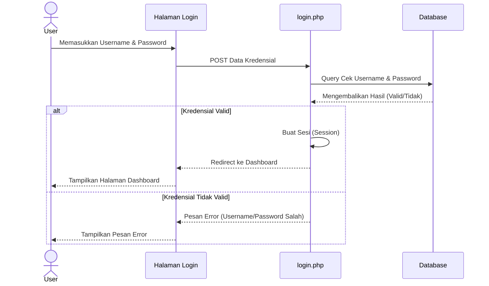

---

## 2. Sequence Diagram - Absensi
Fitur untuk melakukan absensi kehadiran.

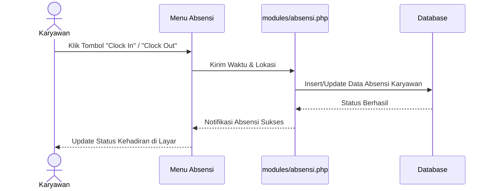

---

## 3. Sequence Diagram - Cuti
Fitur pengajuan cuti oleh karyawan ke atasan/HRD.

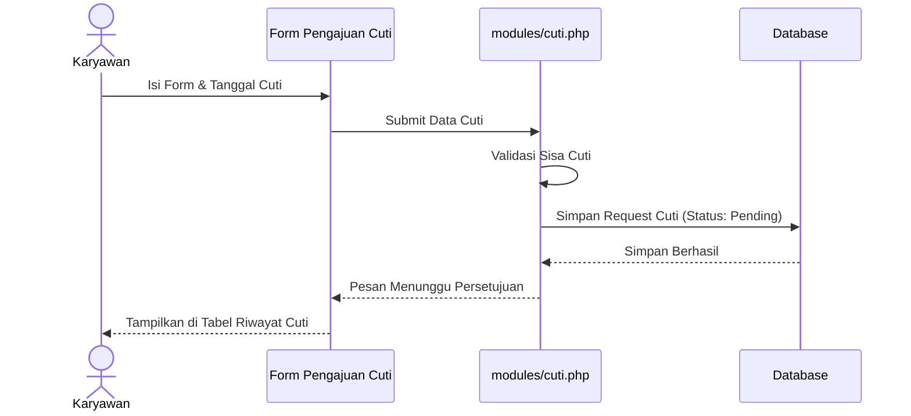

---

## 4. Sequence Diagram - Karyawan (Manajemen Pegawai)
Fitur admin/HR untuk menambahkan data karyawan baru.

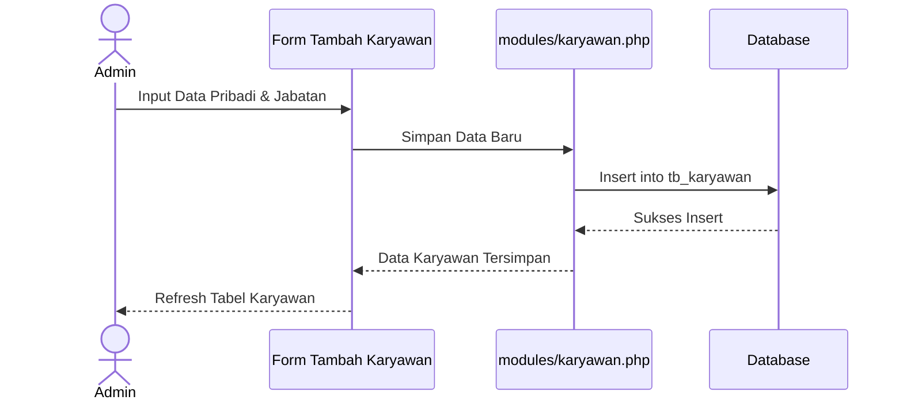

---

## 5. Sequence Diagram - Payroll (Penggajian)
Fitur perhitungan gaji dan pencetakan slip gaji.

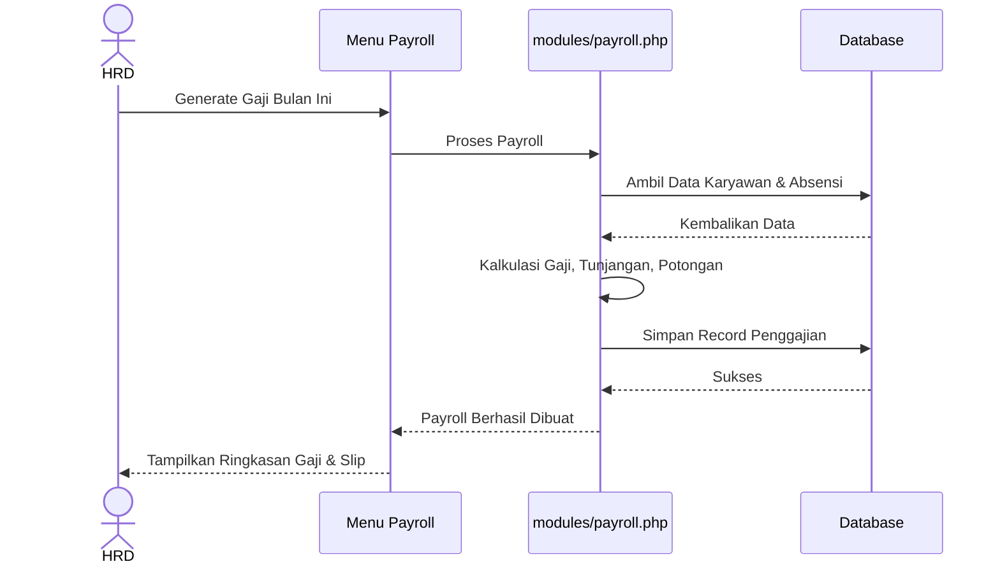

---

## 6. Sequence Diagram - Kinerja
Fitur untuk menginput nilai atau Key Performance Indicator (KPI).

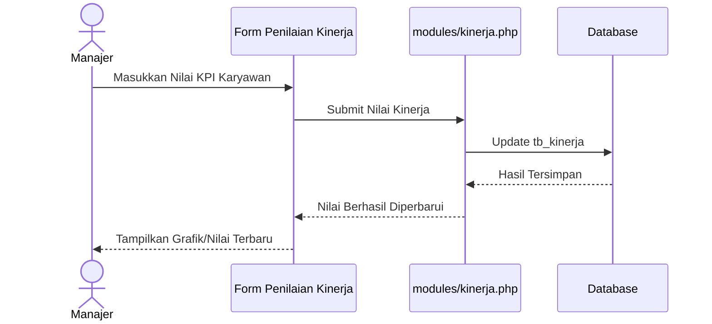

---

## 7. Sequence Diagram - Mutasi
Fitur pemindahan divisi/jabatan karyawan.

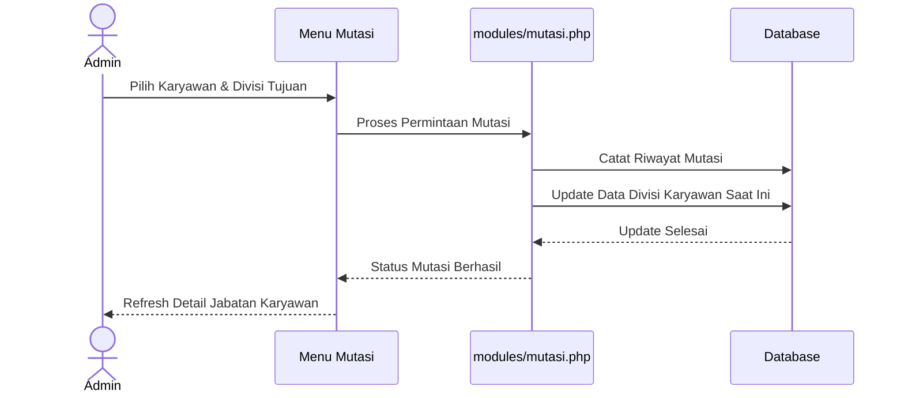

---

## 8. Sequence Diagram - Pelatihan
Fitur menjadwalkan dan mendata pelatihan karyawan.

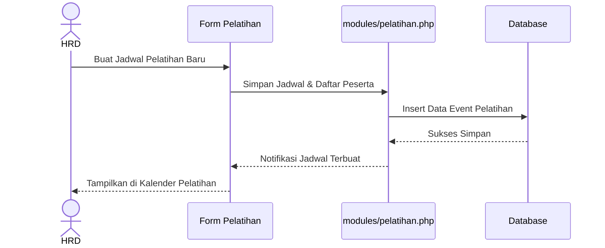

---

## 9. Sequence Diagram - Pengumuman
Fitur mempublikasikan informasi ke seluruh pengguna.

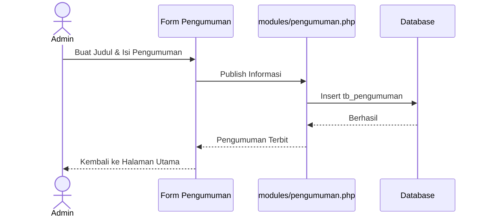

---

## 10. Sequence Diagram - Aset
Fitur pengelolaan dan peminjaman fasilitas/aset kantor.

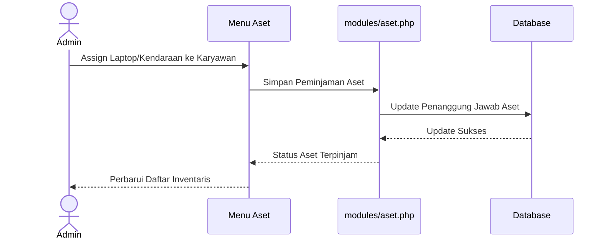

---

## 11. Sequence Diagram - Dashboard
Fitur tampilan utama yang merangkum keseluruhan informasi.

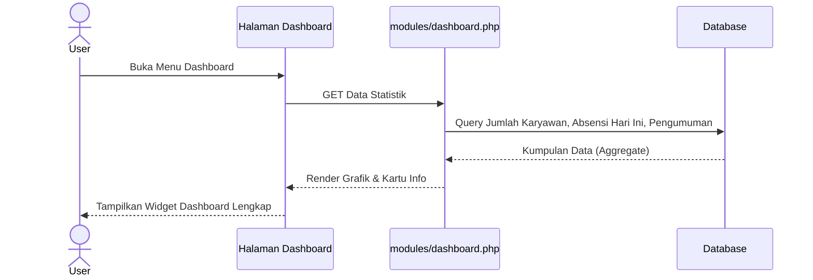
